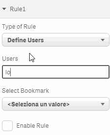

# applySelections
Automatically apply bookmark based on the user that opens the sheet.
This extension can be useful if you want something that emulates the "on sheet opening" actions of qlikview.

The main concept underlying this extension is the concept of rule. A rule is an action that qlik sense has to take when a user opens the sheet. The rule is composed by two parts: the trigger and the action. 
You can define which user triggers the rule on sheet opening, and which bookmark to apply.

You can define up to 10 rules.
After dropping the extension on the sheet, you have to set up at least one rule in the propresties panel.

# Rule Definition

A rule is defined by:
- the user that triggers the rule. Here you have to insert the User ID as you find it in qmc/users. You can define a list of comma separated user ids.
- the bookmark you want to apply. the bookmark must be predefined in sense application.
- a check box that enables the rule.

The first rule can be defined for all users.

In the example: if the one of the two users listed opens the sheet the bookmark EMEA Countries is applied to the qlik sense document.

# Notes

If more than a rule applies to the logged user, only the last enabled rule is applied.

The only element visible to the user is a button. A click on it trigger the associated rule.

When deployed on a local sense installation, the user always gets the value "Personal\Me".

This project is work in progress so I'm waiting for your comments, bug tracking or enhancement requests

# To Do
- add possibility to insert a text button, not only the icon button.
- add more actions, not only apply bookmark, eg. set a variable.
